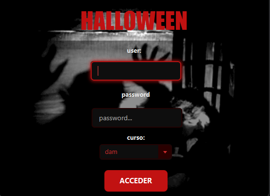
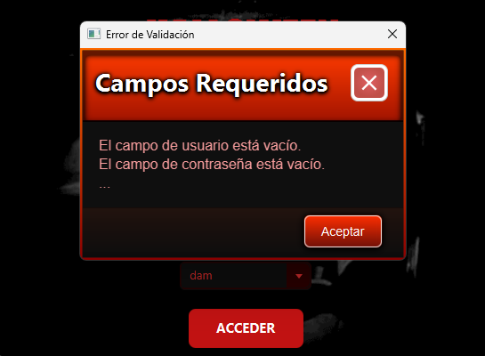
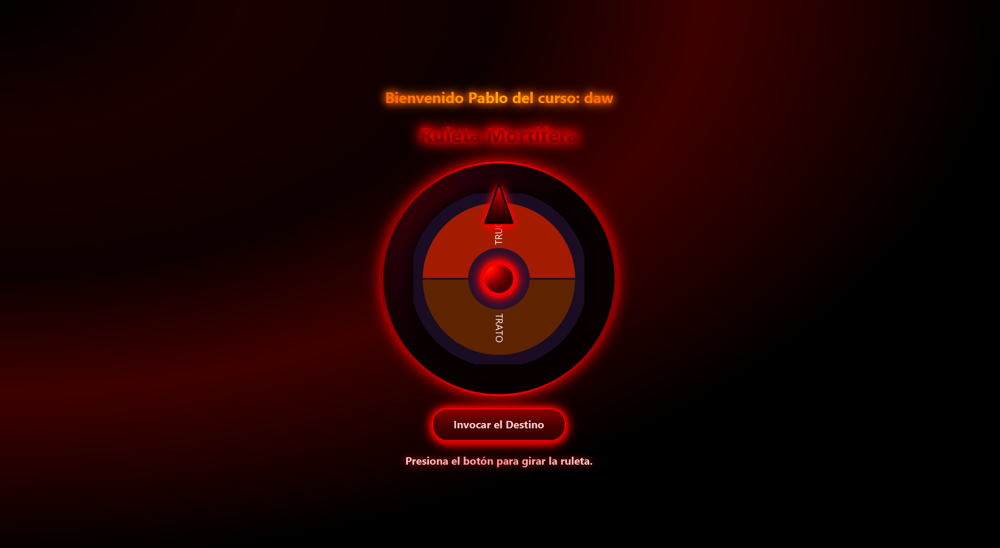
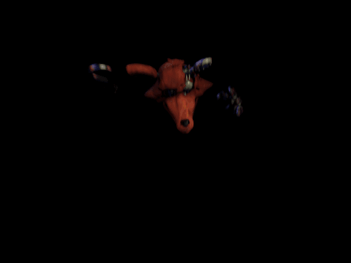
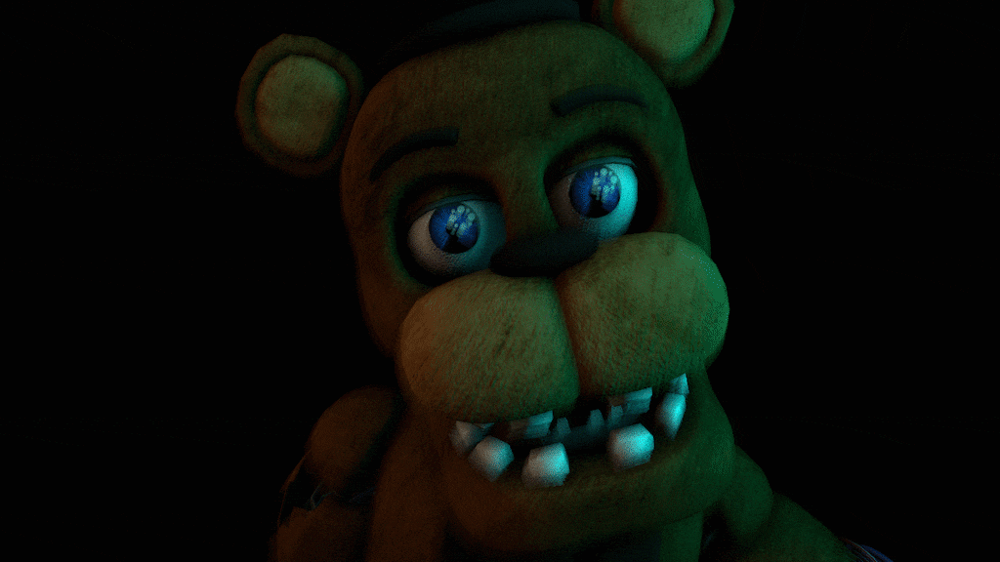

# 🎃 Proyecto "Túnel del Terror → Ruleta TRUCO/TRATO" (JavaFX)

Aplicación interactiva de Halloween desarrollada con **JavaFX + Scene Builder** que implementa un sistema de validación de entrada y una ruleta aleatoria con efectos audiovisuales diferenciados. El proyecto cuenta con dos pantallas principales: un formulario de acceso temático y una ruleta que determina aleatoriamente entre TRUCO o TRATO, cada uno con su propia secuencia de jumpscare personalizada.

---

## 🧭 Índice
1. [Descripción general](#-descripción-general)
2. [Tecnologías y estructura del proyecto](#-tecnologías-y-estructura-del-proyecto)
3. [Arquitectura y componentes](#-arquitectura-y-componentes)
4. [Pantalla 1: Entrada al Túnel](#-pantalla-1-entrada-al-túnel)
5. [Sistema de validación y alertas](#-sistema-de-validación-y-alertas)
6. [Pantalla 2: Ruleta TRUCO/TRATO](#-pantalla-2-ruleta-trucotrato)
7. [Sistema de efectos audiovisuales](#-sistema-de-efectos-audiovisuales)
8. [Gestión multimedia y sonido](#-gestión-multimedia-y-sonido)
9. [Estilos y ambientación visual](#-estilos-y-ambientación-visual)
10. [Instrucciones de ejecución](#-instrucciones-de-ejecución)

---

## 🎯 Descripción general

El proyecto consiste en una aplicación JavaFX completa que simula una experiencia de terror interactiva. El flujo de la aplicación es el siguiente:

1. **Pantalla de Login**: El usuario ingresa su nombre, contraseña y selecciona un curso mediante un formulario validado.
2. **Validación robusta**: Se verifica que todos los campos estén completos antes de permitir el acceso.
3. **Ruleta interactiva**: Una ruleta visual gira con animaciones suaves y determina aleatoriamente el resultado.
4. **Efectos diferenciados**: Según el resultado (TRUCO o TRATO), se ejecuta una secuencia audiovisual única con jumpscare, efectos de sonido y distorsiones visuales.
5. **Experiencia inmersiva**: La ruleta se presenta en pantalla completa con efectos de cámara, temblores y sincronización audiovisual.

---

## 🧱 Tecnologías y estructura del proyecto

### Stack tecnológico
- **Java 21+**: Lenguaje de programación base
- **JavaFX 21**: Framework para interfaces gráficas
- **Maven 3.8+**: Gestión de dependencias y build
- **Scene Builder**: Diseño visual de interfaces FXML
- **CSS3**: Estilización avanzada con animaciones

### Estructura de directorios

```
InterfazHalloween/
├── README.md
└── interfazfx/
    ├── pom.xml
    ├── src/
    │   ├── main/java/org/example/interfazfx/
    │   │   ├── Launcher.java              # Punto de entrada
    │   │   ├── LoginHalloween.java        # Clase Application
    │   │   ├── HelloController.java       # Controlador del login
    │   │   └── RuletaController.java      # Controlador de la ruleta
    │   └── main/resources/org/example/interfazfx/
    │       ├── hello-view.fxml            # Vista del formulario
    │       ├── ruleta-view.fxml           # Vista de la ruleta
    │       ├── halloween-style.css        # Estilos del login
    │       ├── ruleta-style.css           # Estilos de la ruleta
    │       ├── error.css                  # Estilos para alertas
    │       ├── fondo.gif                  # Fondo animado del login
    │       ├── calabaza.png               # Decoración
    │       ├── ghost.png                  # Imagen del fantasma
    │       ├── jumpscare.gif              # GIF para TRUCO
    │       ├── jumpscare2.gif             # GIF para TRATO
    │       └── sfx/                       # Carpeta de efectos de sonido
    │           ├── scream.mp3             # Grito principal (TRUCO)
    │           ├── scream2.mp3            # Grito alternativo (TRATO)
    │           ├── rumble.mp3             # Sonido grave de tensión
    │           └── UíssSsound.mp3         # Audio adicional
    └── target/
```

---

## 🏗️ Arquitectura y componentes

### Patrón de diseño MVC

El proyecto implementa el patrón **Modelo-Vista-Controlador** adaptado a JavaFX:

- **Vista (FXML)**: `hello-view.fxml` y `ruleta-view.fxml` definen la estructura visual
- **Controlador (Java)**: `HelloController.java` y `RuletaController.java` gestionan la lógica
- **Modelo (implícito)**: Los datos del usuario (nombre, curso) se transfieren entre controladores

### Componentes principales

#### 1. Launcher.java
Clase auxiliar que actúa como punto de entrada en entornos Maven/IDE. Evita problemas de empaquetado al separar el `main` de la clase `Application`.

#### 2. LoginHalloween.java
Clase principal que extiende `Application` e inicializa la ventana principal:

**Características clave**:
- Carga el FXML del formulario de entrada
- Aplica la hoja de estilos `halloween-style.css`
- Fija el tamaño de ventana en 900x600px
- Desactiva el redimensionamiento para mantener el diseño

#### 3. HelloController.java
Controlador del formulario de login que gestiona:
- Validación de campos (nombre, contraseña, curso)
- Acumulación de errores mediante `StringBuilder`
- Muestra de alertas personalizadas con CSS temático
- Navegación a la ruleta con transferencia de datos
- Apertura en pantalla completa

#### 4. RuletaController.java
Controlador principal de la ruleta que maneja:
- Dibujo dinámico de la ruleta en Canvas
- Animaciones de giro con interpoladores personalizados
- Cálculo del resultado mediante matemática de ángulos
- Ejecución de secuencias audiovisuales diferenciadas
- Gestión de efectos visuales (flashes, glitch, zoom)
- Control de reproducción multimedia

---

## 🚪 Pantalla 1: Entrada al Túnel



### Componentes visuales

La pantalla de login está compuesta por:

- **Contenedor base**: `Pane` con imagen de fondo animada (`fondo.gif`)
- **Layout principal**: `BorderPane` que organiza título, formulario y botón
- **Campos de entrada**:
  - `TextField` para el nombre de usuario
  - `TextField` para la contraseña
  - `ComboBox<String>` para selección de curso
- **Botón de acceso**: `Button` con id `accederButton` y estilos hover

### Flujo de validación

El controlador implementa un sistema de validación exhaustivo:

1. Al pulsar el botón "ACCEDER", se verifica cada campo
2. Los errores se acumulan en un `StringBuilder`
3. Si hay errores, se muestra un `Alert` personalizado con todos los problemas
4. Si todo es correcto, se carga la pantalla de ruleta en pantalla completa

**Ventajas del sistema**:
- Informa al usuario de **todos** los problemas a la vez
- No requiere múltiples clicks para ver todos los errores
- Feedback claro y conciso

---

## 🛡️ Sistema de validación y alertas

### Método de validación

El método `initialize()` configura el evento del botón:

- Valida que el campo de usuario no esté vacío
- Valida que el campo de contraseña no esté vacío
- Valida que se haya seleccionado un curso
- Acumula todos los errores encontrados
- Muestra un único `Alert` con todos los problemas o procede a abrir la ruleta

### Personalización visual del Alert



La ventana de error aplica el archivo `error.css` directamente sobre el `DialogPane` del `Alert`, logrando:

**Características del error.css**:
- **Fondo oscuro temático** (#1a0d00): Mantiene la ambientación Halloween
- **Borde naranja brillante** (#ff6b00): Resalta la importancia del mensaje
- **Tipografía coherente**: Usa las mismas fuentes góticas del resto de la aplicación
- **Colores de contraste**: Texto claro (#ffcc99) sobre fondo oscuro para máxima legibilidad
- **Efectos de sombra**: Añade profundidad al diálogo

**Ventajas de este enfoque**:
- Experiencia visual consistente incluso en mensajes de error
- No rompe la inmersión temática de Halloween
- Feedback profesional y visualmente atractivo
- El usuario no siente que está ante un error "técnico" genérico

### Navegación a la ruleta

Tras validación exitosa, el método `abrirRuleta()`:

1. Carga el archivo `ruleta-view.fxml`
2. Obtiene el controlador `RuletaController`
3. Transfiere los datos mediante `initializeData(nombre, curso)`
4. Crea una nueva `Scene` y aplica `ruleta-style.css`
5. Crea un `Stage` nuevo y lo configura en pantalla completa
6. Cierra automáticamente la ventana de login

**Manejo de errores**:
- Verifica que el FXML exista antes de cargarlo
- Captura cualquier excepción durante la carga
- Muestra un `Alert` personalizado si algo falla
- Incluye el mensaje de error técnico para debugging

---

## 🎡 Pantalla 2: Ruleta TRUCO/TRATO



### Arquitectura visual

La ruleta está construida sobre un sistema de capas superpuestas:

```
wheelContainer (Pane)
├── wheelCanvas (Canvas) ────────→ Ruleta dibujada
├── pointer (Polygon) ───────────→ Indicador superior
├── hub (Circle) ────────────────→ Centro decorativo
└── effectLayer (Pane) ──────────→ Capa de efectos
    ├── darkOverlay (Rectangle) ─→ Oscurecimiento
    ├── vignette (Rectangle) ────→ Viñeta radial
    ├── strobe (Rectangle) ──────→ Flashes blancos
    ├── ghostView (ImageView) ───→ Imagen fantasma
    └── jumpscareView (ImageView) → GIF jumpscare
```

### Configuración del contenedor

**Dimensiones**:
- Canvas de la ruleta: 320x320px
- Contenedor total: 440x440px (incluyendo padding)
- Radio de la ruleta: 144px
- Puntero: 52px ancho × 74px alto

**Optimizaciones**:
- `setCache(true)`: Cachea el canvas como imagen estática
- `CacheHint.SPEED`: Prioriza rendimiento sobre calidad
- Uso de constantes para evitar recálculos

### Dibujo de la ruleta

La ruleta se dibuja dinámicamente usando `GraphicsContext`:

**Elementos dibujados**:
1. **Anillo exterior decorativo**: Círculo oscuro (#1a0c22) que rodea la ruleta
2. **Secciones coloreadas**: Dos arcos de 180° cada uno
   - TRUCO: Color rojo oscuro (#A31B00)
   - TRATO: Color marrón oscuro (#5E2400)
3. **Bordes separadores**: Líneas gruesas (#1a0c22, 3px) entre secciones
4. **Texto rotado**: Etiquetas "TRUCO" y "TRATO" con fuente Cinzel
5. **Centro decorativo**: Círculo interior que oculta el hub

**Técnica de texto rotado**:
- Se calcula la posición en la circunferencia usando trigonometría
- `gc.save()` guarda el estado actual del contexto
- `gc.translate()` y `gc.rotate()` posicionan y rotan el texto
- Se calcula el ancho del texto para centrarlo correctamente
- `gc.restore()` recupera el estado original

### Elementos decorativos

**Puntero superior**:
- Forma de triángulo creada con `Polygon`
- Gradiente lineal dorado (de #ffd68a a #b37400)
- Borde marrón oscuro (#663b00, 2.2px)
- Sombra proyectada para profundidad

**Hub central**:
- Círculo de 28px de radio
- Gradiente radial dorado (de #ffe8a3 a #c79532)
- Sombra interior para efecto 3D
- Efecto `Glow` animado durante el giro

### Animación del giro

**Secuencia de animación**:

1. **Desactivación del botón**: Evita múltiples giros simultáneos
2. **Limpieza de audio**: Detiene sonidos previos con fade out suave
3. **Efecto glow**: El hub central pulsa entre 0.0 y 0.65 de brillo
4. **Cálculo aleatorio**: Giro entre 720° y 1800° (2-5 vueltas completas)
5. **Duración variable**: Entre 4.2 y 5.2 segundos
6. **Simulación de ticks**: Vibración sutil del puntero durante el giro
7. **Interpolador personalizado**: Curva Bézier SPLINE(0.1, 0.9, 0.2, 1.0)
   - Inicio lento
   - Aceleración progresiva
   - Desaceleración suave al final
8. **Callback de finalización**: Detiene efectos y calcula el resultado

**Mensaje de estado**: "Los espíritus preparan el destino..." durante el giro

### Cálculo del resultado

**Matemática del algoritmo**:

1. Obtener rotación actual del canvas (puede ser > 360°)
2. Normalizar el ángulo al rango 0-359° usando módulo
3. Invertir dirección: `360 - currentRotation` (compensar sentido horario)
4. Ajustar medio sector: `+ anglePerSection / 2` (90° para centrar en el puntero)
5. Calcular índice: `(adjusted / anglePerSection) % SECTIONS.size()`
6. Obtener sección correspondiente: "TRUCO" o "TRATO"

**Precisión**:
- El algoritmo garantiza que el puntero superior siempre apunta al centro de la sección ganadora
- Compensa correctamente la rotación acumulada tras múltiples vueltas

---

## 🎬 Sistema de efectos audiovisuales

### Arquitectura de efectos

El sistema utiliza una **capa de efectos superpuesta** (`effectLayer`) que permanece invisible hasta que se activa un jumpscare:

**Elementos de la capa**:
- `darkOverlay`: Rectangle negro con opacidad graduable (0.0 → 0.55)
- `vignette`: Rectangle con gradiente radial oscuro en los bordes
- `strobe`: Rectangle blanco para flashes estroboscópicos
- `ghostView`: ImageView para mostrar imagen estática del fantasma
- `jumpscareView`: ImageView para mostrar GIFs animados

**Efectos glitch**:
- `GaussianBlur`: Desenfoque variable (0 → 8 → 0)
- `ColorAdjust`: Desplazamiento de matiz y saturación
- `Blend` con `BlendMode.MULTIPLY`: Combina ambos efectos

### Jumpscare TRUCO



**Recursos utilizados**:
- `jumpscare.gif`: GIF aterrador principal
- `scream.mp3`: Grito intenso (volumen 0.9)
- `scream2.mp3`: Trueno/impacto de fondo
- `rumble.mp3`: Sonido grave continuo (volumen 0.4)

**Secuencia de 10 pasos**:

1. **Fundido oscuro** (250ms): El overlay pasa de transparente a negro semitransparente
2. **Sonidos base**: Trueno y rumble comienzan a sonar
3. **Carga del GIF**: Se carga `jumpscare.gif` con opacidad 0
4. **Posicionamiento**: Centrado en 800px de ancho
5. **Zoom de cámara** (240ms): El contenedor escala de 1.0 a 1.06 (2 ciclos)
6. **Aparición violenta** (160ms): El GIF aparece con zoom de 0.85 a 1.35
7. **Grito retrasado** (60ms): El scream.mp3 se reproduce tras un breve delay
8. **Flashes estroboscópicos**: 5 ciclos de flash blanco (35ms on / 55ms off)
9. **Efectos glitch** (300ms): Blur de 0→8→0 y color shift
10. **Temblores múltiples**:
    - `shake1`: Amplitud 16px, 6 ciclos
    - `shake2`: Amplitud 9px, 4 ciclos
11. **Vibración del puntero**: Rotación -12° a 12° (3 ciclos)
12. **Limpieza gradual** (240ms): Todos los efectos vuelven a estado normal

**Duración total**: Aproximadamente 2.5 segundos

**Técnicas avanzadas**:
- `SequentialTransition`: Encadena animaciones en orden
- `ParallelTransition`: Ejecuta varias animaciones simultáneamente
- `Timeline` con `KeyFrame`: Sincronización precisa de efectos
- `TranslateTransition`: Simula temblores de terremoto
- Fade out suave del audio para evitar cortes bruscos

### Jumpscare TRATO



**Recursos utilizados**:
- `jumpscare2.gif`: GIF alternativo para variedad visual
- `scream2.mp3`: Grito diferente cargado en `thunderPlayer`
- `rumble.mp3`: Mismo sonido grave de fondo

**Diferencias con TRUCO**:
- Utiliza un GIF completamente diferente (`jumpscare2.gif`)
- El grito es otro archivo de audio (`scream2.mp3`)
- La secuencia de animación es idéntica en estructura
- Mantiene la misma intensidad pero con assets distintos

**Propósito**:
- Evita que el usuario se acostumbre a un solo tipo de susto
- Añade imprevisibilidad a la experiencia
- Mantiene la tensión en múltiples giros de ruleta

**Opción de himno** (actualmente desactivada):
- Existe un `hymnPlayer` que puede reproducir un himno épico
- Se puede activar descomentando líneas específicas en el código
- Proporcionaría un contraste musical positivo para TRATO

---

## 🔊 Gestión multimedia y sonido

### Carga de recursos

El método `loadOptionalMedia()` carga todos los archivos de audio al inicializar el controlador:

**Archivos cargados**:
- `sfx/scream2.mp3` → thunderPlayer
- `sfx/scream.mp3` → screamPlayer (volumen 0.9)
- `sfx/rumble.mp3` → rumblePlayer (volumen 0.4)
- `sfx/hymn.mp3` → hymnPlayer (volumen 0.85, opcional)

**Manejo de errores**:
- Cada carga está envuelta en un bloque try-catch
- Si un archivo no existe, se ignora silenciosamente
- La aplicación continúa funcionando sin audio si falla la carga

### Reproducción segura

El método `playSafe()` garantiza reproducción sin errores:

**Pasos**:
1. Verifica que el `MediaPlayer` no sea null
2. Detiene cualquier reproducción previa
3. Reinicia la posición al inicio (`seek(Duration.ZERO)`)
4. Inicia la reproducción
5. Captura cualquier excepción y continúa

**Ventajas**:
- Nunca lanza excepciones que detengan la aplicación
- Permite reproducir el mismo sonido múltiples veces
- Resetea correctamente la posición del audio

### Fade out suave

El método `fadeOutAndStop()` evita cortes bruscos de audio:

**Funcionamiento**:
1. Captura el volumen actual del reproductor
2. Crea una `Timeline` que reduce gradualmente el volumen a 0
3. Al finalizar la animación, detiene el reproductor
4. Restaura el volumen original para futuras reproducciones

**Duraciones típicas**:
- thunderPlayer: 150ms
- screamPlayer: 120ms
- rumblePlayer: 120ms
- hymnPlayer: 250ms (más suave por ser música)

### Limpieza al girar

El método `stopAllSoundsSmooth()` se ejecuta al inicio de cada giro:

**Propósito**:
- Detiene todos los sonidos previos con fade out
- Evita superposición de audio de múltiples jumpscares
- Prepara el sistema de audio para la nueva secuencia
- Garantiza experiencia limpia en cada giro

---

## 🎨 Estilos y ambientación visual

### halloween-style.css

Hoja de estilos principal para la pantalla de login:

**Características**:
- **@font-face**: Carga de tipografías góticas personalizadas
- **Gradientes oscuros**: Fondos con degradados rojizos y morados
- **Animaciones glow**: Efecto de resplandor en títulos
- **Hover del botón**: Transiciones suaves de color y sombra
- **Paleta de colores**: Naranjas (#ff6b00), rojos oscuros (#8b0000), negros (#1a0d00)

**Elementos estilizados**:
- Títulos con sombras de texto múltiples
- Botón "ACCEDER" con efecto de iluminación en hover
- Labels con contraste alto para legibilidad
- TextField y ComboBox con bordes temáticos

### error.css

Hoja de estilos exclusiva para ventanas `Alert`:

**Elementos personalizados**:
- `.dialog-pane`: Fondo oscuro (#1a0d00) con borde naranja (#ff6b00, 3px)
- `.header-panel`: Fondo ligeramente más claro (#2d1500)
- `.content`: Texto color crema (#ffcc99), tamaño 14px
- `.button`: Botones con estilo consistente al resto de la app

**Ventaja clave**: Mantiene la inmersión temática incluso en mensajes de error

### ruleta-style.css

Hoja de estilos para la pantalla de la ruleta:

**Efectos principales**:
- **Fondo nocturno**: Gradiente radial desde centro oscuro a bordes más claros
- **Botón de giro**: Efecto de iluminación intensa con sombras doradas
- **Clase `.celebration`**: 
  - Color dorado brillante (#ffd166)
  - Tamaño de fuente grande (26px)
  - Efecto `dropshadow` con resplandor dorado
  - Se aplica al resultado final para destacarlo

**Elementos estilizados**:
- `.wheel-pointer`: Puntero superior con gradiente y borde
- `.wheel-hub`: Hub central con estilo dorado
- Labels de información con tipografía clara
- Contenedores con espaciado y alineación perfectos

---

## 🛠️ Instrucciones de ejecución

### Requisitos previos

- **JDK 21 o superior**: Descargar desde [Oracle](https://www.oracle.com/java/technologies/downloads/) o [OpenJDK](https://openjdk.org/)
- **Maven 3.8+**: Gestor de dependencias ([Descargar Maven](https://maven.apache.org/download.cgi))
- **Git**: Para clonar el repositorio (opcional)

### Ejecución con Maven

```bash
# Navegar a la carpeta del proyecto
cd interfazfx

# Limpiar y compilar
mvn clean compile

# Ejecutar la aplicación
mvn javafx:run
```

Maven descargará automáticamente JavaFX y todas las dependencias necesarias.

### Ejecución con IDE

**IntelliJ IDEA**:
1. Abrir proyecto desde `pom.xml`
2. Esperar a que Maven sincronice las dependencias
3. Ejecutar la clase `Launcher.java`
4. Alternativamente, usar el plugin de Maven: `interfazfx → Plugins → javafx → javafx:run`

**Eclipse**:
1. Importar como "Existing Maven Project"
2. Seleccionar la carpeta `interfazfx`
3. Click derecho en `Launcher.java` → Run As → Java Application

**NetBeans**:
1. Open Project → Seleccionar `interfazfx`
2. Esperar resolución de dependencias
3. Run Project o ejecutar `Launcher.java` directamente

### Verificación de recursos multimedia

**IMPORTANTE**: Asegurarse de que estos archivos existan en `src/main/resources/org/example/interfazfx/`:

**Imágenes**:
- `fondo.gif` (fondo animado del login)
- `calabaza.png` (decoración)
- `ghost.png` (imagen del fantasma)
- `jumpscare.gif` (GIF para TRUCO)
- `jumpscare2.gif` (GIF para TRATO)

**Sonidos** (carpeta `sfx/`):
- `scream.mp3` (grito principal)
- `scream2.mp3` (grito alternativo)
- `rumble.mp3` (sonido grave)
- `UíssSsound.mp3` o `hymn.mp3` (opcional)

**Si faltan recursos**:
- La aplicación seguirá funcionando
- Los jumpscares se ejecutarán en modo "fallback" sin GIF
- Los sonidos simplemente no se reproducirán
- No se lanzarán excepciones que detengan la app

### Resolución de problemas comunes

**Error: "JavaFX runtime components are missing"**
- Solución: Ejecutar con `mvn javafx:run` en lugar de `java -jar`
- Maven gestiona automáticamente el classpath de JavaFX

**Error: "No se encontró ruleta-view.fxml"**
- Verificar que los archivos FXML estén en `src/main/resources/org/example/interfazfx/`
- Recompilar con `mvn clean compile`

**La aplicación no reproduce sonidos**
- Verificar que los archivos MP3 existen en `sfx/`
- Comprobar que el sistema tenga codecs MP3 instalados
- La app funciona normalmente sin audio

**Ventana de error sin estilos**
- Verificar que `error.css` existe en resources
- Comprobar la ruta en `getClass().getResource()`

---

## 📊 Características técnicas destacadas

### Optimizaciones de rendimiento

- **Canvas caching**: Reduce redibujado de la ruleta
- **CacheHint.SPEED**: Prioriza FPS sobre calidad de imagen
- **Efectos condicionales**: Los glitch solo se aplican durante jumpscares
- **Lazy loading de multimedia**: Los recursos se cargan una vez al inicio

### Patrones de diseño utilizados

- **MVC (Model-View-Controller)**: Separación clara de lógica y presentación
- **Observer Pattern**: Listeners de eventos en botones y animaciones
- **Strategy Pattern**: Diferentes estrategias audiovisuales según resultado
- **Facade Pattern**: `RuletaController` oculta complejidad de animaciones

### Técnicas avanzadas de JavaFX

- **Interpoladores personalizados**: Curvas Bézier para animaciones realistas
- **Composición de efectos**: `Blend` combina múltiples efectos visuales
- **Transformaciones acumulativas**: Rotaciones, escalados y traslaciones simultáneas
- **Timeline con KeyFrame**: Sincronización precisa al milisegundo
- **AnimationTimer**: Bucle de renderizado para efectos en tiempo real

### Experiencia de usuario

- **Feedback inmediato**: Validación instantánea al pulsar botón
- **Mensajes claros**: Errores acumulados y bien descritos
- **Prevención de errores**: Botones deshabilitados durante animaciones
- **Consistencia visual**: Toda la app mantiene la temática Halloween
- **Experiencia inmersiva**: Pantalla completa sin distracciones

---

## 🎓 Conceptos educativos demostrados

### Interfaces gráficas (RA1)
- Diseño de layouts complejos con BorderPane, VBox, StackPane
- Uso de Scene Builder para diseño visual
- Manejo de múltiples ventanas (Stage)
- Transición entre escenas

### Eventos y controladores (RA2)
- Listeners de eventos (`setOnAction`, `setOnFinished`)
- Callbacks en animaciones
- Manejo de eventos de mouse (hover)

### Animaciones y efectos (RA3)
- Transiciones: Rotate, Scale, Translate, Fade
- Timelines con KeyFrames
- Interpoladores personalizados
- Efectos visuales: Blur, ColorAdjust, DropShadow, Glow

### Validación y feedback (RA4)
- Validación de formularios
- Mensajes de error informativos
- Alertas personalizadas con CSS
- Estados de UI (botones habilitados/deshabilitados)

### Multimedia (RA5)
- Reproducción de audio con MediaPlayer
- Carga de imágenes y GIFs
- Sincronización audiovisual
- Manejo robusto de recursos

---

## 📝 Licencia y créditos

**Proyecto educativo** - Módulo M5 (Desarrollo de Interfaces)

**Tecnologías**: JavaFX 21, Maven, Scene Builder

**Recursos multimedia**: Todos los assets (GIFs, MP3, PNG) son de uso educativo

---

**¡Disfruta del terror! 🎃👻**
